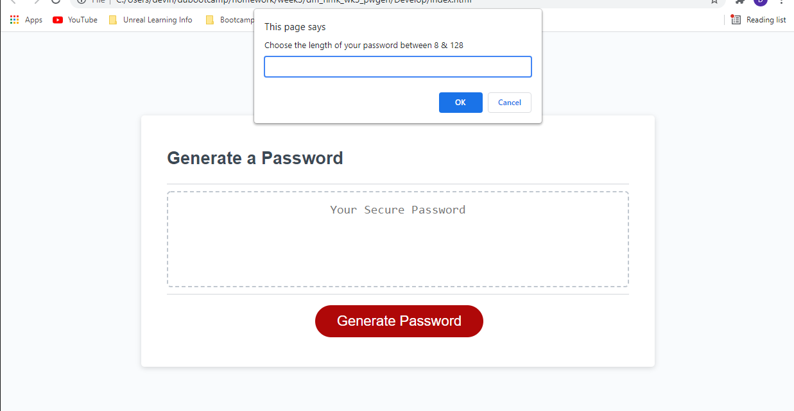

# Password Generator Week 3 Homework

## Description

The goal of this homework assignment was to create a password generator. The generator operates after clicking a button that creates a randomly generated password to meet a criteria input by the user. Creating the generator tested my knowledge of JavaScript functions, methods, and traversing the DOM. This assignment also allowed me to experiment with manipulating the HTML using JavaScript.

## Tasks Completed

- WHEN clicking on the button to generate a password, THEN you are presented with a series of prompts for password criteria
- WHEN prompted for password criteria, THEN you select which criteria to include in the password
- WHEN prompted for the length of the password, THEN you choose a length of at least 8 characters and no more than 128 characters
- WHEN asked for character types to include in the password, THEN you confirm whether or not to include lowercase, uppercase, numeric, and/or special characters
- WHEN you answer each prompt, THEN your input will be validated and at least one character type will be selected
- WHEN all prompts are answered, THEN a password is generated that matches the selected criteria
- WHEN the password is generated, THEN the password is  written to the page

## To access the password generator

Click on provided links:
- [Deployed URL](https://dmosca2021.github.io/dm_hmk_wk3_pwgen/)
- [Repo URL](https://github.com/DMosca2021/dm_hmk_wk3_pwgen)

## How to use the password generator

Once arriving to the password generator website, click the "Generate Password" button to start the generator. A series of prompts to determine the length and character type for the password will ensue. After confirmation of your choices the password will generate in the box ready for use. 

## Credits

Credit for this project goes to my instructor, teacher's assistants, and fellow students in the DUbootcamp who provided the information and resources I needed to complete this task.

- [W3 Schools](https://www.w3schools.com/js/default.asp)
- [MDN Web Docs](https://developer.mozilla.org/en-US/docs/Web/API/EventTarget/addEventListener)
- [Google](https://www.google.com/)